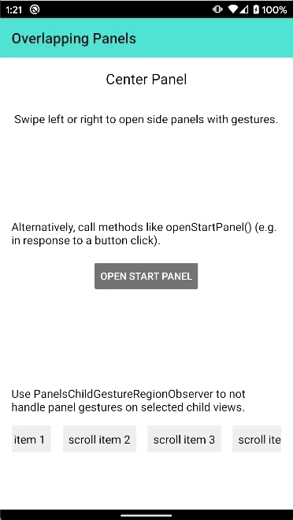
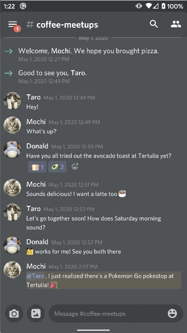

# OverlappingPanels

[](https://travis-ci.org/discord/OverlappingPanels)

OverlappingPanels is a gestures-driven navigation UI library for Android. Compared to DrawerLayout
gestures, OverlappingPanels gestures are much less likely to conflict with Android 10's system back
gestures because `OverlappingPanelsLayout` handles swipe gestures across its entire layout and not
only from the edges of the screen. OverlappingPanels can act as a secondary navigation component in
apps that use a bottom navigation bar / tabs as a primary navigation component.

**OverlappingPanels Examples**
| OverlappingPanels Sample App | Discord Android App |
| -- | -- |
|  |  |

Installation
-------
Add the JitPack repository to your root `build.gradle` file:
```gradle
allprojects {
    repositories {
        ...
        maven { url 'https://jitpack.io' }
    }
}
```

Then add the OverlappingPanels gradle dependency:
```gradle
dependencies {
    implementation 'com.github.discord:OverlappingPanels:x.y.z'
}
```

Replace `x`, `y`, and `z` with the corresponding release version numbers in the
[OverlappingPanels release page](https://github.com/discord/OverlappingPanels/releases).


Basic Usage
-------
`OverlappingPanelsLayout` is a `ViewGroup` that expects exactly three child views that represent
the start panel, center panel, and end panel. The simplest way to use `OverlappingPanelsLayout`
is to wrap the panel content in XML:

```xml
<com.discord.panels.OverlappingPanelsLayout
    android:id="@+id/overlapping_panels"
    android:layout_width="match_parent"
    android:layout_height="match_parent">


    <!-- Set layout_gravity on the start panel to "start" -->
    <FrameLayout
        android:id="@+id/start_panel"
        android:layout_width="wrap_content"
        android:layout_height="match_parent"
        android:layout_gravity="start">
        ...
    </FrameLayout>

    <FrameLayout
        android:id="@+id/center_panel"
        android:layout_width="wrap_content"
        android:layout_height="match_parent">
        ...
    </FrameLayout>

    <!-- Set layout_gravity on the end panel to "end" -->
    <FrameLayout
        android:id="@+id/end_panel"
        android:layout_width="wrap_content"
        android:layout_height="match_parent"
        android:layout_gravity="end">
        ...
    </FrameLayout>

</com.discord.panels.OverlappingPanelsLayout>
```

Wrapping the panel content in `OverlappingPanelsLayout` automatically enables panel gestures where
swiping left and right will open and close the corresponding side panels.

Core Features
-------
Check out the [Overlapping Panels sample app](https://github.com/discord/OverlappingPanels/tree/master/sample_app)
for examples on how to use the core features of `OverlappingPanelsLayout`:

1. Panel gestures
2. Programmatically opening side panels
3. Maintaining panel state through device rotations
4. Registering child gesture regions that handle their own horizontal scrolls


License
-------
Copyright (C) 2020 Discord Inc.

Licensed under the Apache License, Version 2.0 (the "License");
you may not use this file except in compliance with the License.
You may obtain a copy of the License at

    http://www.apache.org/licenses/LICENSE-2.0

Unless required by applicable law or agreed to in writing, software
distributed under the License is distributed on an "AS IS" BASIS,
WITHOUT WARRANTIES OR CONDITIONS OF ANY KIND, either express or implied.
See the License for the specific language governing permissions and
limitations under the License.
